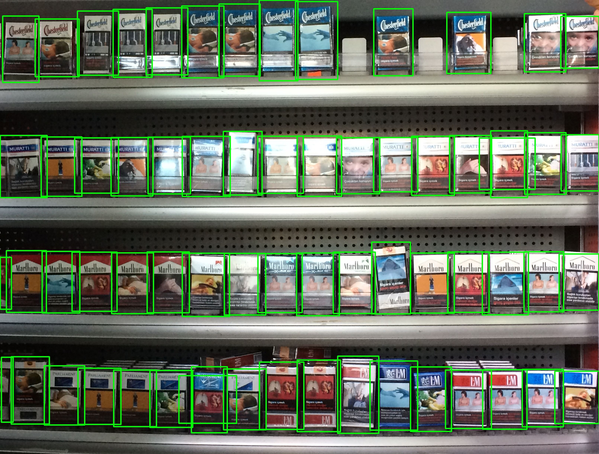
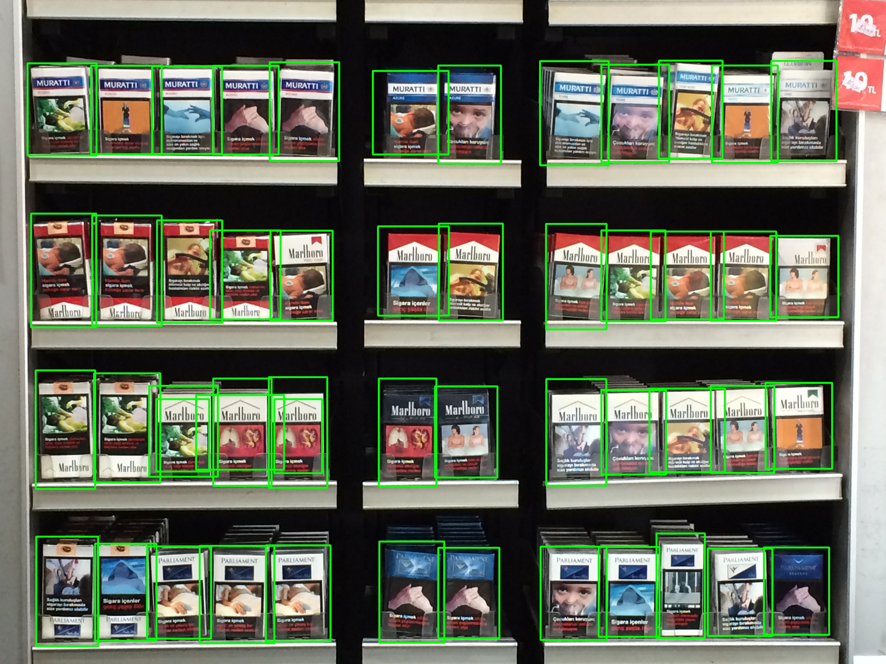

<!-- TABLE OF CONTENTS -->

  
Table of Contents

  <ol>
     
    <li>
      <a href="#output-of-the-model">Output of the Model</a>
    </li>
    <li><a href="#product-detection-:-0.90-map">Product Detection using Yolov4</a></li>
    <li><a href="#product-classification">Product Classification</a></li>
  </ol>

## Output of the Model:

[Drive Link](https://drive.google.com/drive/folders/1x5H6Xn3B3Ha-t2uFy1NsouqSFxZC53Mk?usp=sharing)
    Plotted the detected bounding boxes on the image.
 
 

## Product Detection: 0.90 mAP
    

    
    I have trained the yolov4 model using the product dataset.
    
    Dataset Preparation:
    1. Created a txt file containing the coordinates of the bounding boxes for each image
    2. Txt file format : class mid_x mid_y width height \n class mid_x mid_y width height ... for n items 
    3. The bounding box should be normalized by Image's width and height.
    4. Created a configuration file with class=1 , as we are only interested at product/no_prodct detection.
    
    Training:
    1. Trained the network for 1000 epochs.
    
    Evaluation:
    1. Calculated Precision, Recall and mAP.

## Product Classification :  99.97% acc on Test set

[Drive Folder of Augmented Images](https://drive.google.com/drive/folders/1btYOQfTe7QTFAMuf8ljPsvsTryisBbXB?usp=sharing)

    I also tried classifying the products using GroceryDataset_part1/ProductImages, But I saw many products on the shelf are out of the 10 categories.
    
    Dataset Prepartion:
    1. Created Dataloader using Tensorflow tf.data
    2. Image Augmentation ( Random flip, rotation, saturation, centre_zoom ) 
    3. Augmented Images's folder (Drive link is provided) 

    
    Training:
    1. Used Tranfer Learning
    2. Took an Inceptionv3 model and added a Dense layer of 10 neurons at tail of the network.
    3. Trained it for 5 epochs
    
    I achieved 99.97% accuracy on test set.
   
